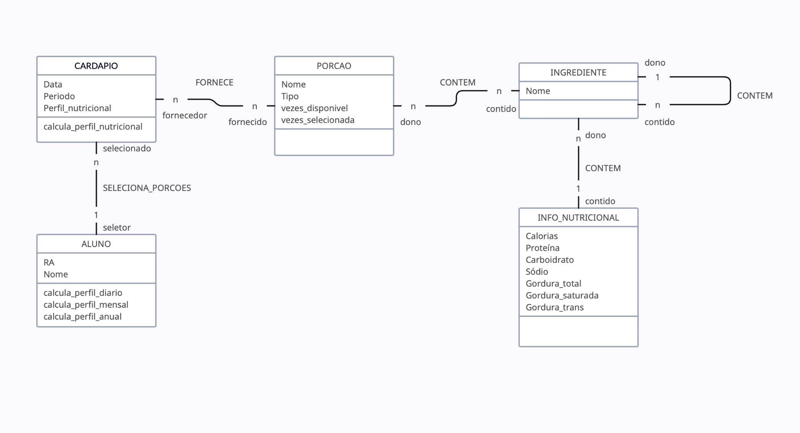

# Equipe Data Miners

# Subgrupo A

- Lucio Bueno Vieira Junior - 221029
- Guilherme Sampaio Cintra - 248313
- Guilherme de Oliveira Zaleski - 235914

## Modelo Conceitual UML Revisado



_Diagrama UML Original_

## Mapeamento para o Modelo Relacional

```
INFO_NUTRICIONAL(_ID_, Calorias, Proteína, Carboidrato, Sódio, Gordura_total, Gordura_saturada, Gordura_trans)

INGREDIENTE(_Nome_,Info_nutricional)
  Info_nutricional chave estrangeira -> INFO_NUTRICIONAL(ID)

INGREDIENTE_CONTEM(_Ingrediente_pai_, _Ingrediente_filho_)
  Ingrediente_pai chave estrangeira -> INGREDIENTE(Nome)
  Ingrediente_filho chave estrangeira -> INGREDIENTE(Nome)

PORÇÃO(_Nome_, Tipo, vezes_disponível, vezes_selecionada)

PORÇÃO_INGREDIENTES(_Porção_, _Ingrediente_)
  Porção chave estrangeira -> PORÇÃO(Nome)
  Ingrediente chave estrangeira -> INGREDIENTE(Nome)

CARDAPIO(_Data_, Período, Perfil_nutricional)
  Perfil_nutricional chave estrangeira -> INFO_NUTRICIONAL(ID)

CARDAPIO_INGREDIENTES(_Cardapio_, _Ingrediente_)
  Porção chave estrangeira -> PORÇÃO(Nome)
  Ingrediente chave estrangeira -> INGREDIENTE(Nome)

ALUNO(_RA_, Nome)

ALUNO_CARDAPIO(_Aluno_, _Cardapio_)
  Aluno chave estrangeira -> ALUNO(RA)
  Cardapio chave estrangeira -> CARDAPIO(Data, Período)
```
