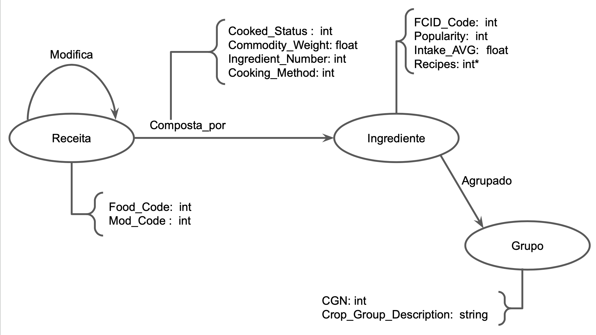

# Equipe Data Miners

# Subgrupo A

- Lucio Bueno Vieira Junior - 221029
- Guilherme Sampaio Cintra - 248313
- Guilherme de Oliveira Zaleski - 235914

## Modelo Lógico preliminar de grafo

## Perguntas de pesquisa/análise

Pergunta 1: Ingredientes de um determinado grupo aparecem mais vezes nas receitas em uma forma de preparo específica? (cozido, frito…)

Pergunta 2: Quais são as receitas mais parecidas de acordo com os ingredientes em comum?

Pergunta 3: Se uma receita tiver uma modificação, qual das suas variações possui a menor quantidade de ingredientes?

Pergunta 4: Os ingredientes mais populares possuem uma participação maior nas receitas? (em peso)

Pergunta 5: Qual a média de consumo de alimentos fritos e cozidos?

Pergunta 6: Ingredientes de um determinado grupo aparecem em um peso maior nas receitas? 

Pergunta 7: Quantas receitas não possuem nenhum alimento de origem animal?

