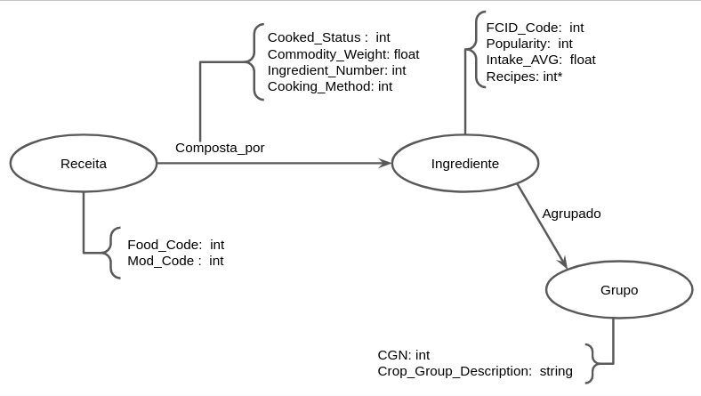

# Equipe Data Miners

# Subgrupo A
- Lucio Bueno Vieira Junior - 221029
- Guilherme Sampaio Cintra - 248313
- Guilherme de Oliveira Zaleski - 235914

## Modelo Lógico do Banco de Dados de Grafos
> 

## Perguntas de Pesquisa/Análise Combinadas e Respectivas Análises

### Pergunta/Análise 1
* **Pergunta 1:** Se uma receita tiver uma modificação, qual das suas variações possui a menor quantidade de ingredientes?
>
* Centralidade por grau. Uma análise possível para encontrar alternativas mais baratas para receitas seria analisar a quantidade de arestas de todas as modificações de uma determinada receita e encontrar aquela que tenha grau de adjacência mais baixo, em outras palavras, encontrar a receita menos central no que se refere ao grau dos nós. Dessa forma, estariámos comparando os nós que representam receitas quanto ao número de arestas que os ligam aos nós que representam os ingredientes que as compõem, de forma que um grau de adjacência menor, indica que uma receita leva menos ingredientes e consequentemente é uma potencial alternativa mais barata para a receita original.
### Pergunta/Análise 2
* **Pergunta 2:** Retirando os ingredientes de origem animal, qual a porcentagem das receitas restam no grafo?
>
* Vulnerabilidade. Reformulando o questionamento sobre a quantidade de receitas sem ingredientes de origem animal (Lab 07), podemos analisar a importância/relevância dos ingredientes carnívoros, excetuando esses tipos de alimentos e as respectivas receitas que os possuem em sua composição para comparar o grafo original ao grafo resultante. Essa análise só é possível visto que a tabela que contém as receitas lista os ingredientes que as compõem e os ingredientes por sua vez são divididos em grupos, que por fim são referenciados em uma tabela organizada de forma que todos os grupos alimentícios de origem animal são separados em um intervalo numérico bem definido. Dessa forma, filtrando ingredientes que possuem CGN (do inglês, crop group number) neste intervalo, podemos retirar do grafo receitas não-veganas, restando apenas receitas originalmente veganas e variações sem carne de receitas onívoras, determinando assim o grau de relevância desse tipo de ingrediente para a formação do grafo original e a participação de receitas veganas na amostra de receitas tomada.

### Pergunta/Análise 3
* **Pergunta 3:** Ingredientes de um mesmo grupo aparecem mais vezes na mesma receita do que ingredientes de grupos diferentes?
>   
* Realizando uma projeção sobre as receitas e os grupos de cada um de seus ingredientes, encontramos uma rede homogênea onde os nós representam as receitas e as arestas os "Crop groups" que elas compartilham entre si. A partir dessa rede pode ser analisado o conceito de comunidade, haja visto a notável divisão entre as receitas levando em consideração as origens dos ingredientes que as compõe e avaliando esse agrupamento podemos definir quais as receitas são mais semelhantes no que se refere aos ingredientes que as compõem.
